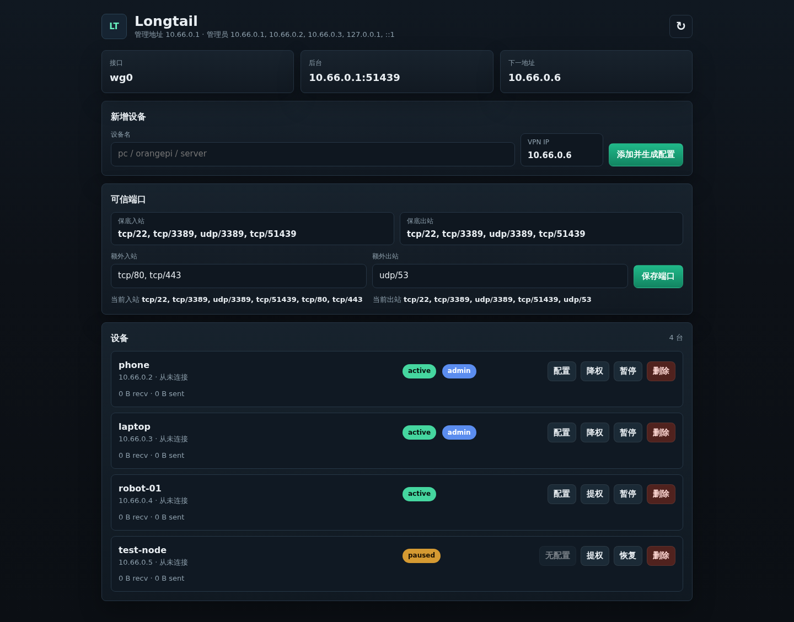

# Longtail

English | [中文](README.zh-CN.md)

Longtail is a lightweight, fully open-source WireGuard web admin panel. Give an
AI assistant one sentence with your server address, let it prepare the install
commands, then manage WireGuard devices from a browser.



## Features

- AI one-sentence setup: ask AI to configure Longtail for your server.
- AI-assisted one-command install with `deploy/bootstrap.sh`.
- Fully open-source and self-hosted.
- Lightweight Python/Flask web admin console.
- WireGuard protocol underneath, compatible with standard WireGuard clients.
- Add devices, scan QR codes, download `.conf` files, pause peers, grant admin
  access, and control trusted ports from the web UI.

## AI Setup Prompt

Hands-on mode:

```text
Please install and configure Longtail for me. My server IP/domain is: ____.
After installation, give me the WireGuard QR code, the web admin URL, and the verification steps.
```

Command-only mode:

```text
Please generate the commands to install Longtail on my server. My server IP/domain is: ____.
Do not connect to my server. Only output the commands I need to run, remind me to allow udp/51820, and include how to open the web admin console.
```

## Install

```bash
sudo apt update
sudo apt install -y git

sudo git clone https://github.com/equationofmathphysics/longtail.git /opt/longtail
cd /opt/longtail

sudo ./deploy/bootstrap.sh YOUR_SERVER_IP_OR_DOMAIN:51820 phone
```

`bootstrap.sh` installs dependencies, creates `/etc/longtail/longtail.env`,
creates or reuses `/etc/wireguard/wg0.conf`, starts `wg-quick@wg0` and
`longtail-web`, and prints the first WireGuard QR code.

Allow the public WireGuard port in your cloud firewall or security group:

```text
udp/51820
```

## Web Admin

After scanning the QR code and turning on WireGuard, open:

```text
http://10.66.0.1:51437/
```

From a computer outside the VPN, use an SSH tunnel:

```bash
ssh -L 51437:10.66.0.1:51437 user@your-server
```

Then open:

```text
http://127.0.0.1:51437/
```

## Verify

```bash
sudo systemctl status wg-quick@wg0 --no-pager
sudo systemctl status longtail-web --no-pager
```

## Configuration

Main config file:

```text
/etc/longtail/longtail.env
```

Common settings:

```env
NET_TOOLS_SERVER_ENDPOINT=YOUR_SERVER_IP_OR_DOMAIN:51820
NET_TOOLS_WG_CONF=/etc/wireguard/wg0.conf
NET_TOOLS_WG_CIDR=10.66.0.0/24
NET_TOOLS_SERVER_VPN_IP=10.66.0.1
NET_TOOLS_CLIENT_ALLOWED_IPS=10.66.0.0/24
NET_TOOLS_ADMIN_IPS=127.0.0.1,::1,10.66.0.1
NET_TOOLS_BIND_HOST=10.66.0.1
NET_TOOLS_FIREWALL_ENABLED=1
```

Full examples are in `deploy/longtail.env.example` and `deploy/examples/`.

## Security

- Do not commit generated client configs, QR-code images, or
  `/var/lib/longtail`; they may contain private keys.
- Do not expose the web admin console directly to the public internet.
- Only `udp/51820` needs to be public by default.
- Keep admin access limited to localhost and trusted WireGuard devices.

## License

This project is released under the WH Covenant Public License. Use, copying,
modification, distribution, and other dealings are subject to [LICENSE](LICENSE).
